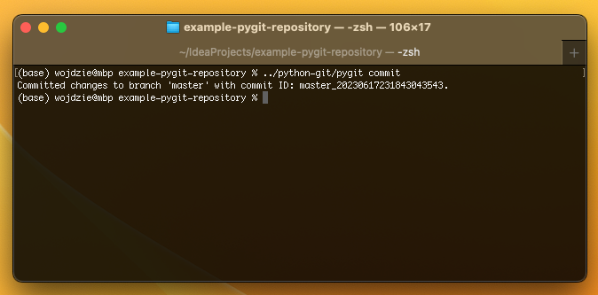

# PyGit - simple version control system implemented in Python

## How to use PyGit?

### Initialization


To initialize a new repository, use the following command:
```bash
pygit init
```

### Adding Files


To add files to the staging area, use the following command:
```bash
pygit add <file1> <file2>
```
Replace `<file1>`, `<file2>`, etc. with the paths to the files you want to add.

### Committing Changes



To commit the changes in the staging area, use the following command:
```bash
pygit commit
```
This will create a new commit with the changes in the staging area.

### Switching Branches


To switch to a different branch, use the following command:
```bash
pygit checkout <branch-name>
```
Replace `<branch-name>` with the name of the branch you want to switch to.

### Viewing Commit History


To view the commit history, use the following command:
```bash
pygit log
```
This will display a list of commits with their respective details.